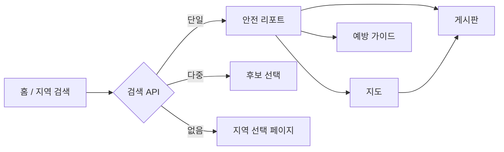

<!--
  SAFE TRIP 프로젝트 README
  GitHub·로컬 문서용 (마크다운)
-->
<div align="center">

# 🛡️ SAFE TRIP

**여행지 안전 정보를 한곳에서 — 검색 · 리포트 · 지도 · 커뮤니티**

Spring Boot 기반 여행 안전 플랫폼  
지역별 범죄 통계, CCTV·경찰 시설, 카카오맵 시각화, 신고 게시판을 제공합니다.

<br>


</div>

---

## 📌 소개

**SAFE TRIP**은 국내 여행·체류 시 필요한 **지역 안전 정보**를 탐색할 수 있는 웹 서비스입니다.

- 키워드로 **시·도 / 시·군·구**를 찾고 안전 리포트로 이동
- **범죄 유형별 통계**, CCTV·경찰서 수, **지역 유형** 설명 확인
- **카카오맵**으로 경찰 시설 위치 표시
- 여행자 **신고 게시판**으로 위험 정보 공유
- **범죄 예방 가이드**로 대응 수칙 확인

---

## ✨ 주요 기능

| 기능 | 설명 |
|------|------|
| 🔍 **지역 검색** | 별칭(홍대, 해운대 등) · 키워드 · 다중 후보 선택 지원 (`/api/search`) |
| 📊 **안전 리포트** | 안전 점수, 범죄 TOP3, CCTV·경찰 수, `region_type` 안내 |
| 🗺️ **안전 지도** | 경찰서 실좌표 마커 · 지역별 신고글 요약 · 필터 |
| 📝 **신고 게시판** | CRUD, 카테고리·지역·키워드 검색, 작성자 권한 |
| 📖 **예방 가이드** | 절도·폭력·성범죄 등 7개 유형 탭 (`/guide?type=`) |
| 🔐 **회원** | 회원가입 · 로그인 · BCrypt · CSRF |

---

## 🔄 서비스 흐름



---

## 🛠 기술 스택

| 구분 | 기술 |
|------|------|
| Backend | Java 21, Spring Boot 3.5, Spring Security, Spring Data JPA |
| View | Thymeleaf, Thymeleaf Spring Security 6 |
| DB | MySQL |
| Build | Gradle |
| Map | Kakao Maps JavaScript API, Geocoder |
| Frontend | HTML / CSS, Lucide Icons, Font Awesome |

---

## 🚀 시작하기

### 요구 사항

- **JDK 21**
- **MySQL 8** (로컬)
- **[Kakao Developers](https://developers.kakao.com)** JavaScript 키 (지도용)

### 1. 데이터베이스

```sql
CREATE DATABASE travel_safe_platform
  CHARACTER SET utf8mb4
  COLLATE utf8mb4_unicode_ci;
```

### 2. 설정

`src/main/resources/application.properties`에서 DB 접속 정보와 카카오 키를 환경에 맞게 수정합니다.

```properties
spring.datasource.url=jdbc:mysql://localhost:3306/travel_safe_platform?serverTimezone=Asia/Seoul
spring.datasource.username=root
spring.datasource.password=YOUR_PASSWORD

kakao.map.javascript-key=YOUR_KAKAO_JAVASCRIPT_KEY
```

> ⚠️ API 키·DB 비밀번호는 Git에 커밋하지 말고, 로컬 전용 설정 또는 환경 변수로 관리하는 것을 권장합니다.

### 3. 실행

```bash
# Windows
gradlew.bat bootRun

# macOS / Linux
./gradlew bootRun
```

브라우저에서 **http://localhost:8080** 접속 후 회원가입 → 로그인합니다.  
(메인 `/`만 비로그인 허용, 대부분 기능은 로그인 필요)

### 4. 초기 데이터

최초 실행 시 `regions` 테이블이 비어 있으면 아래 CSV가 자동 적재됩니다.

| 파일 | 내용 |
|------|------|
| `src/main/resources/data.csv` | 시·군·구, 범죄 통계, CCTV·경찰 수, 지역 유형 |
| `src/main/resources/police.csv` | 경찰서·지구대·파출소 좌표 |
| `RegionAliasInitializer` | 검색 별칭 (홍대, 강남, 제주 등) |

데이터를 다시 넣으려면 관련 테이블을 비운 뒤 애플리케이션을 재시작하세요.

---

## 📁 프로젝트 구조

```
travel-safe-platform/
├── src/main/java/.../
│   ├── config/          # Security, DataInitializer, RegionAlias
│   ├── controller/      # Page, Board, Search, Report/Map API
│   ├── service/         # Region, Report, User, CurrentUser
│   ├── entity/          # User, Report, Region, CrimeStat, PoliceStation
│   └── dto/
├── src/main/resources/
│   ├── templates/       # Thymeleaf 페이지 + fragments
│   ├── static/          # CSS, JS, images
│   ├── data.csv
│   ├── police.csv
│   └── application.properties
└── build.gradle
```

---

## 🌐 주요 URL

| 경로 | 설명 |
|------|------|
| `/` | 메인 (공개) |
| `/users/signup`, `/users/login` | 회원가입 · 로그인 |
| `/region` | 지역 검색 |
| `/report?regionId=` | 안전 리포트 |
| `/map?regionId=` | 안전 지도 |
| `/guide`, `/guide?type=theft` | 예방 가이드 |
| `/board`, `/board/write`, `/board/{id}` | 신고 게시판 |
| `GET /api/search?keyword=` | 지역 검색 API |
| `GET /api/reports/{id}` | 지역 리포트 JSON |
| `GET /api/map/regions/{id}` | 지도용 지역·경찰·게시글 JSON |

---

## 🗺️ 지도 · 좌표 안내

| 데이터 | 좌표 |
|--------|------|
| 경찰 시설 | `police.csv` 기반 **실제 위·경도** |
| 신고 게시글 | 현재 **시·군·구 단위** — 지도에서는 지역 중심 근처에 **대략 배치** |
| (예정) | 글쓰기 시 지도 클릭·주소 지오코딩으로 **게시글별 실좌표** 저장 |

---

## 🔒 보안

- Spring Security 폼 로그인, BCrypt 비밀번호 암호화
- CSRF 보호 (Thymeleaf 폼 + `csrf-fetch.js`)
- 게시글 **작성자만** 수정·삭제
- 로그인 사용자 기준 게시글 작성 (`CurrentUserService`)

---

## 👥 팀 / 라이선스

교육·포트폴리오용 프로젝트입니다.  
데이터 출처·카카오 API 이용 약관을 준수해 사용하세요.

---

<div align="center">

**안전한 여행을 응원합니다** ✈️

</div>
